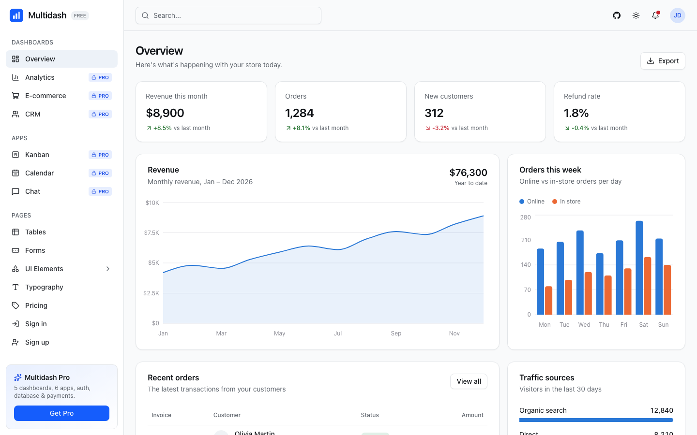

# Multidash

[](https://github.com/hasraltechno/multidash/releases)
[](LICENSE)
[](https://multidash-app.vercel.app)
[](https://nextjs.org)
[](https://tailwindcss.com)

**Free & open-source admin dashboard template** built with **Next.js 16**, **React 19**, **Tailwind CSS v4** and **Radix UI**.

Clean, accessible and responsive — with light/dark mode, colorblind-safe charts and a reusable component library you can drop into any Next.js project.

<picture>
  <source media="(prefers-color-scheme: dark)" srcset="./.github/preview-dark.png" />
  
</picture>

**[Live demo](https://multidash-app.vercel.app)** · [Get Multidash Pro](#-multidash-pro) · [Report a bug](https://github.com/hasraltechno/multidash/issues)

---

## ✨ Features

- ⚡ **Next.js 16 App Router** + React 19 + TypeScript
- 🎨 **Tailwind CSS v4** with a single token file for rebranding
- 🌗 **Light / dark / system** theme plus a **theme customizer** — primary color, backgrounds, card style, radius and monochrome
- 📊 **Charts** with Recharts — colorblind-safe palette, tooltips, screen-reader data tables
- 🧩 **35 UI components** (`@multidash/ui`) built on Radix UI primitives — each with docs, live examples and copy-paste code
- 📱 **Fully responsive** — mobile sidebar drawer
- ♿ **Accessible** — keyboard navigation, ARIA labels, reduced-motion support
- 📦 **Turborepo monorepo** — share the UI package across apps

### Included pages

| Page | Description |
| --- | --- |
| Overview | KPI cards, revenue area chart, orders bar chart, recent orders, traffic sources |
| Tables | Basic, standard and advanced (TanStack Table) tables with sorting, faceted filters, column visibility, selection and pagination |
| Forms | Profile and notification settings layouts |
| UI Elements | Docs for every component: live examples, source code and installation steps |
| Typography | Heading, paragraph, list, quote and code styles with copyable classes |
| Pricing | Plan cards, feature comparison, FAQ and a Pro waitlist form |
| Error pages | 404, 500 and maintenance screens |
| Sign in / Sign up | Authentication page UI |
| ⌘K search | Command palette over every page and component |

## 🚀 Getting started

Requirements: **Node.js 20+** and **pnpm** (`corepack enable pnpm`).

```bash
git clone https://github.com/hasraltechno/multidash.git
cd multidash
pnpm install
pnpm dev
```

Open [http://localhost:3000](http://localhost:3000).

| Command | Description |
| --- | --- |
| `pnpm dev` | Start the dev server |
| `pnpm build` | Production build |
| `pnpm typecheck` | Type-check all packages |

### Environment variables

All optional — copy [`apps/demo/.env.example`](apps/demo/.env.example) to `apps/demo/.env.local` to use them.

| Variable | Purpose |
| --- | --- |
| `NEXT_PUBLIC_SITE_URL` | Public site URL for Open Graph and canonical links |
| `RESEND_API_KEY`, `RESEND_SEGMENT_ID` | Store waitlist signups as [Resend](https://resend.com) contacts |
| `WAITLIST_WEBHOOK_URL` | Or send waitlist signups to any JSON webhook |

## 📁 Project structure

```
multidash/
├── apps/
│   └── demo/                 # Next.js dashboard app
│       ├── app/(dashboard)/  # Pages with sidebar layout
│       ├── app/(auth)/       # Sign in / sign up
│       ├── components/       # App-specific components & charts
│       └── lib/              # Navigation, mock data, helpers
└── packages/
    ├── ui/                   # @multidash/ui — shared components & theme tokens
    └── typescript-config/    # Shared tsconfig presets
```

## 🎨 Customization

Set your own domain in [`apps/demo/lib/site.ts`](apps/demo/lib/site.ts) (`productionUrl`) or via the `NEXT_PUBLIC_SITE_URL` environment variable — it is used for Open Graph and canonical URLs.

All colors live in [`packages/ui/src/styles/globals.css`](packages/ui/src/styles/globals.css). Change `--primary` (and `--primary-text`) to rebrand; chart colors (`--chart-1` … `--chart-5`) are a validated colorblind-safe order — keep the order if you swap hues.

The theme customizer presets live in [`apps/demo/app/theme-presets.css`](apps/demo/app/theme-presets.css) — add your own by following the same pattern.

Status colors (`info`, `success`, `warning`, `destructive`, `highlight`) each have three roles, so bright fills never compromise text contrast:

| Token | Use for | Example |
| --- | --- | --- |
| `--success` | Fills and solid backgrounds | `bg-success`, `fill-warning` |
| `--success-foreground` | Text on a solid background | `text-success-foreground` |
| `--success-text` | Colored text on the page or a soft tint | `text-success-text` |

Use a component anywhere in the app:

```tsx
import { Button } from "@multidash/ui/components/button"

<Button variant="outline">Click me</Button>
```

## 💎 Multidash Pro

Need more? **Multidash Pro** builds on this free version with everything you need to ship a real product:

| | Free | Pro |
| --- | :---: | :---: |
| Overview dashboard | ✅ | ✅ |
| Base UI components | ✅ | ✅ |
| Data tables with sorting, filters & selection | ✅ | ✅ |
| Analytics, E-commerce, CRM, SaaS & Finance dashboards | — | ✅ |
| Kanban, Calendar, Chat, Inbox, Invoice apps | — | ✅ |
| Working authentication & role-based access | — | ✅ |
| Database layer (Drizzle ORM) | — | ✅ |
| Payments — Stripe, Midtrans & Xendit | — | ✅ |
| i18n (English, Bahasa Indonesia) | — | ✅ |
| Data table CSV/Excel export & server-side pagination | — | ✅ |
| Priority support | — | ✅ |

👉 **[See pricing & join the waitlist](https://multidash-app.vercel.app/pricing)**

## 🤝 Contributing

Issues and pull requests are welcome — see [CONTRIBUTING.md](CONTRIBUTING.md). If Multidash saves you time, please consider giving it a ⭐ — it really helps!

## 📄 License

[MIT](LICENSE) © Hasral Techno
